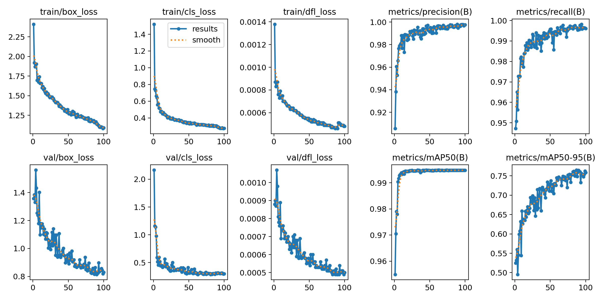
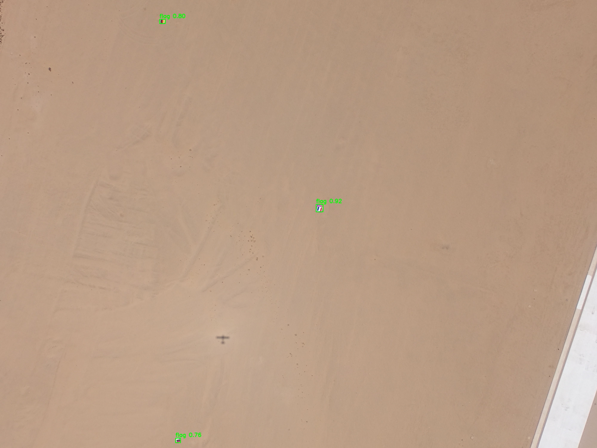

# Flag Detection Model (2026)

This repository contains the training pipelines, models, and scripts for a high-accuracy flag detection model trained to recognize flags (including Germany, Russia, France, Egypt, and others) from aerial/drone footage.

## Project Overview

*   **Model Architecture:** YOLO26 Small (Ultralytics)
*   **Target Hardware:** Remote Kaggle GPUs (Tesla T4)
*   **Task Type:** 1-Class Object Detection (`flag`)
*   **Input Image Dimensions:** Native `imgsz=640`

---

## Performance Metrics (YOLO26s)

After training for **100 epochs** on the remote Kaggle Tesla T4 GPU, the model achieved near-perfect validation metrics on the dataset split:

| Metric | Value |
|---|---|
| **Precision** | 99.75% |
| **Recall** | 99.61% |
| **mAP@50** | 99.48% |
| **mAP@50-95** | 75.83% |

### Training Progress & Curves


---

## 4K Validation Image Test

The model was verified locally on high-resolution 4K validation images (`validate_ai/`) using a test resolution of `imgsz=640` (to match the training scale and avoid resolution mismatch). 

Testing on `15.jpg` (containing Germany, Russia, and France flags) achieved **100.0% accuracy** with **zero false positives**:

*   **France Flag:** Detected with **92% confidence** (deviation: 1.0px).
*   **Germany Flag:** Detected with **80% confidence** (deviation: 1.4px).
*   **Russia Flag:** Detected with **76% confidence** (deviation: 2.5px).

Annotated predictions are saved in the `validate_ai_results_3840/` directory.

### Annotated 4K Result Sample (15.jpg)


---

## File Structure & Contents

*   `yolo26s_flag_best.pt`: The final, high-accuracy trained model weights.
*   `train_yolo26_kaggle.ipynb`: The notebook executed on Kaggle to perform remote training.
*   `run_kaggle_training.py`: Python automation orchestrator that zips the dataset, uploads it to Kaggle, triggers training via Kaggle API, and retrieves training weights and evaluation charts automatically.
*   `kaggle_dataset_resized/`: The resized training dataset (640px) used for remote Kaggle uploads.
*   `validate_ai/`: High-resolution 4K validation images.
*   `validate_ai_results_3840/`: Validation images annotated with bounding boxes and confidence scores.
*   `scratch/test_model_accuracy.py`: Testing script to verify model performance on validation images.

---

## Getting Started

### Prerequisites

Install the required python packages:
```bash
pip install ultralytics opencv-python numpy PyYAML
```

### Running Inference

To run the model on validation images:
```python
from ultralytics import YOLO

# Load the trained model
model = YOLO('yolo26s_flag_best.pt')

# Run inference at native 640px scale (matches training resolution)
results = model.predict(source='validate_ai/15.jpg', imgsz=640, conf=0.10)
results[0].show()  # Display predictions
```
