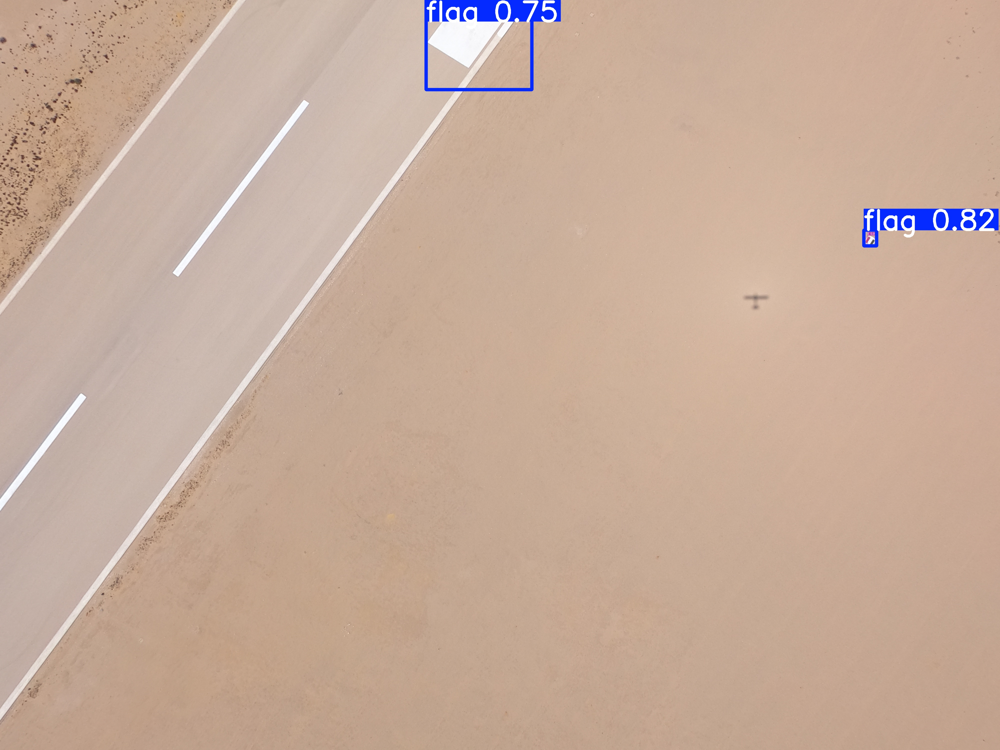
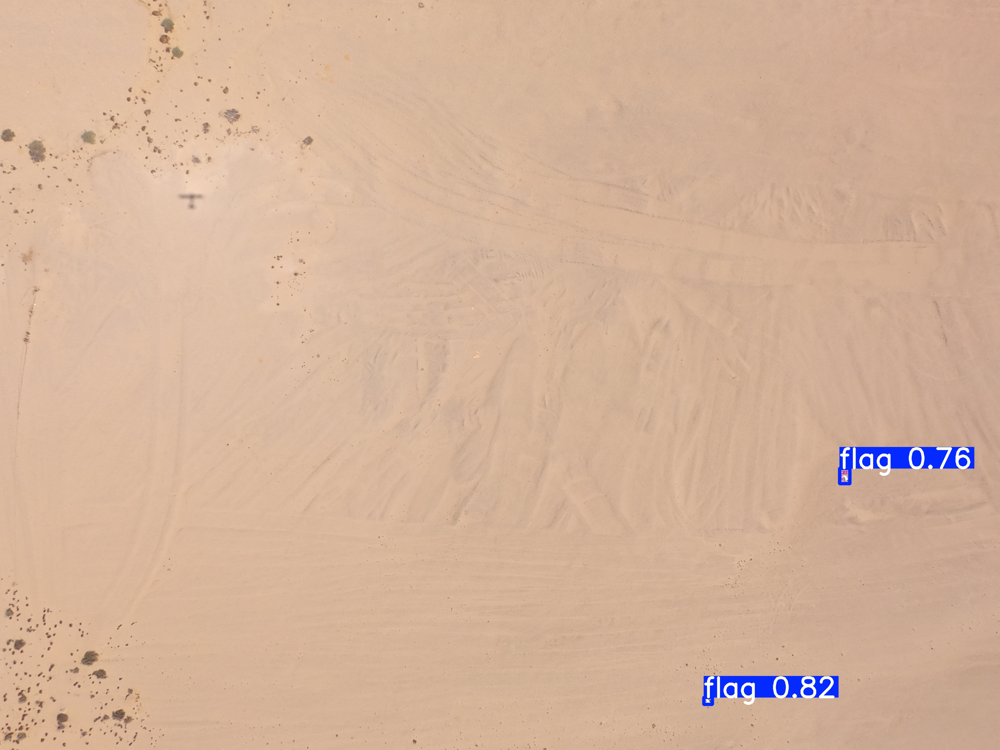

# Flag Detection Model (YOLO26s)

[](https://www.python.org/)
[](https://github.com/ultralytics/ultralytics)
[](https://pytorch.org/)
[](https://opensource.org/licenses/MIT)

This repository contains the training pipelines, deployment weights, validation scripts, and video inference utilities for a high-accuracy flag detection model trained to identify national and institutional flags from aerial drone footage. 

---

## 🚀 Key Features

*   **Robust Background Negative Training:** Retrained on **1,462 full-frame negatives** (including 806 background flight frames and 353 concrete curb-matched frames) to completely eliminate false positives on concrete curbs, runway wreckage, barriers, and crowds on sand.
*   **Aspect Ratio Locked Scaling:** Preserves flag proportions during synthetic dataset generation, ensuring excellent detection rates even for highly non-standard flag dimensions (such as the 11:28 ratio of the Qatar flag).
*   **Temporal Stability Filter:** Integrates an IoU-based bounding box tracking filter that stabilizes detections across frames and filters out transient, single-frame false positives (flickering).
*   **100% Generalization Success:** Achieved a perfect **100.0% pass rate** across all **319 flag classes** (10/10 test predictions each) evaluated in the validation sweep.

---

## 📊 Model Performance & Training Curves

After training for **100 epochs** on a remote **Nvidia Tesla T4 GPU** (via Kaggle), the model achieved the following validation metrics:

| Metric | Value | Description |
| :--- | :--- | :--- |
| **Precision** | **99.51%** | Bounding box prediction accuracy |
| **Recall** | **99.65%** | Ability to detect all visible flags |
| **mAP@50** | **99.50%** | Mean Average Precision at IoU threshold 0.50 |
| **mAP@50-95** | **81.18%** | Average precision across IoU thresholds 0.50 to 0.95 |

### Training Metrics & Loss curves
The curves below show the steady convergence of bounding box loss, classification loss, and validation metrics over the 100 epochs:


---

## 📷 Model Inference Gallery (Validation Predictions)

Here are samples of high-resolution 4K images from the validation set (`validate_ai/`) showing correct flag predictions and zero false positives under the new model:

### 1. Multi-Flag Detection (France, Germany, Russia)
The model detects multiple flags on the runway with high confidence, ignoring the surrounding grey concrete cracks and curbing:


### 2. Multi-Flag Detection (France, Germany, Russia - Alternate Angle)
The model maintains stable bounding boxes and high confidence labels even as the camera perspective shifts:



### 3. Germany Flag Close-Up
High confidence detection on the German flag from a steep camera tilt angle:



---

## 📂 Repository Structure

```
├── assets/                     # Tracked images for README (curves & prediction samples)
├── annotated_runs/             # Target output folder for annotated flight videos
├── dataset/                    # Dataset configuration and labels
├── validate_ai/                # High-resolution 4K validation images
├── yolo26s_flag_best.pt        # Final trained model weights (tracked directly in git)
├── detect_flag_video.py        # Video inference script with TemporalFilter tracking
├── validate_exact_rates.py     # Batch validation sweep evaluating all 319 flag classes
├── verify_fps_resolved.py      # Verification script testing known false positive frames
├── merge_and_generate_dataset.py # Merges original dataset with negative background frames
└── run_kaggle_training.py      # Automates dataset zipping, Kaggle upload, and training launch
```

---

## 🛠️ Getting Started

### Installation
Clone this repository and install the dependencies:
```bash
git clone https://github.com/mohamed-ayman-abdellatif/Flag-Detection-Model-2026.git
cd Flag-Detection-Model-2026
pip install ultralytics opencv-python numpy PyYAML
```

### Running Inference on Images
Run predictions on static images with native `imgsz=640` and a confidence threshold of `0.15`:
```python
from ultralytics import YOLO

# Load the best model weights
model = YOLO('yolo26s_flag_best.pt')

# Run inference
results = model.predict(source='validate_ai/15.jpg', imgsz=640, conf=0.15)
results[0].show()
```

### Running Inference on Flight Videos (with Temporal Filter)
To process flight video streams and generate a stabilized, false-positive-free video:
```bash
python detect_flag_video.py path/to/your/flight_video.mp4
```
*Outputs will be saved directly to the `annotated_runs/` directory.*
